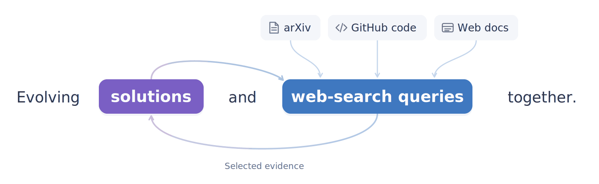
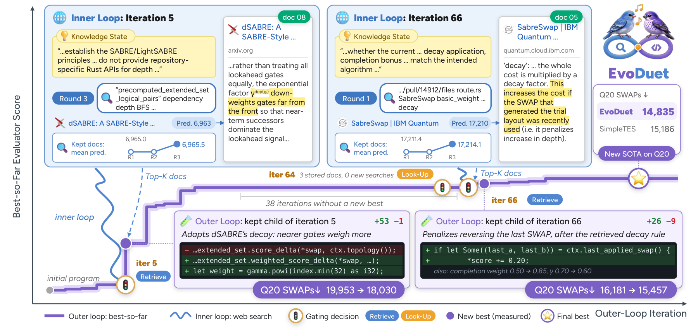
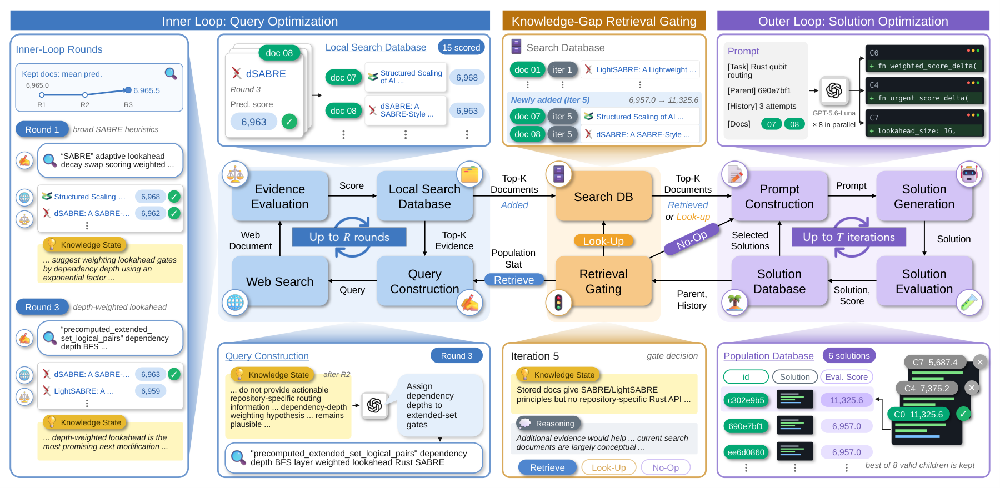

<p align="center">
  
</p>

<p align="center">
  
</p>

<p align="center">
  <picture>
    <source media="(prefers-reduced-motion: reduce) and (max-width: 600px)" srcset="assets/readme/tagline-mobile.svg">
    <source media="(prefers-reduced-motion: reduce)" srcset="assets/readme/tagline.svg">
    <source media="(max-width: 600px)" srcset="assets/readme/tagline-mobile.gif">
    
  </picture>
</p>

<p align="center">
  <a href="#quickstart"></a>
  <a href="#benchmarks"></a>
  <a href="https://github.com/Open-Galapagos/EvoDuet/actions/workflows/ci.yml"></a>
  <a href="LICENSE"></a>
</p>

<p align="center">
  <a href="#overview"><b>Overview</b></a> &nbsp;·&nbsp;
  <a href="#installation"><b>Installation</b></a> &nbsp;·&nbsp;
  <a href="#quickstart"><b>Quickstart</b></a> &nbsp;·&nbsp;
  <a href="#benchmarks"><b>Benchmarks</b></a> &nbsp;·&nbsp;
  <a href="#citation"><b>Citation</b></a>
</p>

---

> **September 2026 · Code release.** EvoDuet, 31 paper tasks, and four shared experiment launchers.

## Overview

**Better search informs better solutions; evaluated solutions guide the next search.**
EvoDuet couples program evolution with a web-search loop that adapts to the
current solution's knowledge gaps.

|  Web search · Inner loop |  Solutions · Outer loop |
| --- | --- |
| Refine queries and select useful evidence while keeping the parent solution fixed. | Generate candidate programs, evaluate them, and record which evidence helped. |
| **Signal:** predicted solution quality from the retrieved evidence. | **Signal:** actual scores from the task evaluator. |

A **retrieval gate** connects the loops. It chooses whether to **retrieve** new
web evidence, **look up** saved evidence, or **continue without documents**.

<p align="center">
  
  <br>
  <sub>A search trajectory on Swap Reduction: useful evidence carries forward across solution revisions.</sub>
</p>

<details>
<summary><b>See the full method: retrieval gate, query evolution, and solution evolution</b></summary>

<p align="center">
  
</p>

1. **Decide what knowledge is needed.** Inspect the current solution, search
   history, and stored evidence to choose retrieve, look-up, or no-op.
2. **Evolve the queries.** Refine queries using web results and remaining
   knowledge gaps. Rank evidence by predicted solution quality, with the parent
   solution fixed throughout the inner rounds.
3. **Evolve the solutions.** Generate and evaluate candidates using the selected
   evidence. Save the measured outcomes with that evidence for future decisions.

The inner loop predicts scores without generating or evaluating candidate
solutions. The outer evaluator measures actual improvement. With parallel
EvoDuet, retrieve/look-up iterations use multiple candidates and no-op iterations
use one. Model weights remain fixed throughout.

</details>

## Installation

Built on [SkyDiscover](https://github.com/skydiscover-ai/skydiscover).
Use **Python 3.12** and [uv](https://docs.astral.sh/uv/).

```bash
git clone --recurse-submodules https://github.com/Open-Galapagos/EvoDuet.git
cd EvoDuet
uv sync --frozen --extra dev
cp .env.example .env
```

Add your model provider's key to `.env`:

- **OpenAI:** set `OPENAI_API_KEY` and use your model ID.
- **OpenRouter:** set `OPENROUTER_API_KEY` and use `openrouter/author/model`.

EvoDuet web retrieval also requires `TAVILY_API_KEY`. Baseline runs use only the
model provider's key. Use `--api-base` for a custom OpenAI-compatible endpoint.
The quickstart uses SimpleTES Circle Packing (26 circles); install its standard
math dependencies:

```bash
uv pip install numpy scipy scikit-learn psutil cvxpy
```

<details>
<summary><b>Installing other benchmark families</b></summary>

See the [benchmark catalog](benchmarks/README.md) for setup instructions. Some
families require downloaded datasets, Docker, or a GPU. Optional dependency
groups cover several families:

```bash
# Math and ADRS
uv sync --frozen --extra dev --extra math --extra adrs

# ALE-Bench
git submodule update --init --recursive
uv sync --frozen --extra dev --extra ale-bench
```

Include all desired extras in one `uv sync` invocation; each invocation updates
the environment to the selected groups. The launchers use the installed
environment without syncing it again.

</details>

## Quickstart

From the repository root, preview the task and launch EvoDuet. Replace
`YOUR_MODEL` with a model available through your provider.

```bash
TASK="benchmarks/simpletes/datasets/circle_packing/simpletes_circle_packing_26"

# Preview the task and settings
bash scripts/run_evoduet.sh "$TASK" --dry-run

# Run EvoDuet
bash scripts/run_evoduet.sh "$TASK" \
  --model YOUR_MODEL --iterations 100 --seed 42 --output outputs/circle-packing
```

### Choose an experiment

| Mode | Script | Candidates per iteration |
| --- | --- | --- |
| **EvoDuet** | [`run_evoduet.sh`](scripts/run_evoduet.sh) | 1 |
| **Parallel EvoDuet** | [`run_evoduet_parallel.sh`](scripts/run_evoduet_parallel.sh) | 8 after retrieve/look-up; 1 after no-op |
| **Baseline** | [`run_baseline.sh`](scripts/run_baseline.sh) | 1 |
| **Parallel baseline** | [`run_baseline_parallel.sh`](scripts/run_baseline_parallel.sh) | 8 every iteration |

EvoDuet uses the retrieval gate described above; the baseline disables retrieval.
Tasks run sequentially. Parallel modes generate candidates within each task:
the baseline evaluates one candidate at a time, while EvoDuet allows up to N
concurrent evaluations for N candidates.

<details>
<summary><b>Run parallel EvoDuet or the baseline</b></summary>

```bash
TASK="benchmarks/simpletes/datasets/circle_packing/simpletes_circle_packing_26"

# Parallel EvoDuet
bash scripts/run_evoduet_parallel.sh "$TASK" \
  --model YOUR_MODEL --num-generations 8 --output outputs/circle-packing-parallel

# Program evolution without retrieval
bash scripts/run_baseline.sh "$TASK" \
  --model YOUR_MODEL --output outputs/circle-packing-baseline

# Parallel program evolution without retrieval
bash scripts/run_baseline_parallel.sh "$TASK" \
  --model YOUR_MODEL --num-generations 8 --output outputs/circle-packing-baseline-parallel
```

Without task arguments, each script loops over its editable `TASKS=(...)` list of
21 SimpleTES tasks. Complete the [SimpleTES setup](benchmarks/simpletes/README.md#setup)
before running the full list:

```bash
MODEL=YOUR_MODEL bash scripts/run_evoduet.sh
```

Task paths before flags replace that list. Each invocation uses one seed and
edit mode per task: seed 42 and diff edits by default. All four scripts accept
`--model`, `--api-base`, `--iterations`, `--seed`,
`--output`, `--checkpoint`, and `--edit diff` or `--edit full`. Use
`--num-generations` to change the candidate count, including for the baseline.
The default search scaffold is `openevolve_native`; choose another with
`--search`. The installed `evoduet-run` command provides the same interface.

</details>

<details>
<summary><b>Search budgets, checkpoints, and your own task</b></summary>

| Inner-loop setting | Default | Flag |
| --- | ---: | --- |
| Rounds | 3 | `--inner-rounds` |
| Queries per round | 1 | `--query-count` |
| Results per query | 5 | `--documents-per-query` |
| Retained documents | 3 | `--search-top-k` |

Advanced options accept dotted flags, such as `--llm.temperature 0.7` or
`--evoduet.retrieval_gating_backend_type always`.
Only the current `evoduet` settings are supported. The former `world_knowledge`
section and removed experiment options are rejected in YAML and CLI overrides.

**Resume a run:** pass `--checkpoint PATH` with the same task and settings.
`PATH` is the checkpoint directory. EvoDuet automatically saves `evoduet.json`
inside it, containing search history, retrieved documents, and evidence credit,
and restores that state on resume. Resume requires a checkpoint written by this
release, with completion marker schema version 2 and EvoDuet state schema version 1.
Older checkpoint formats and missing state are rejected; start a new run to use
this release. Baselines do not require `evoduet.json`, except EvoX, which stores
its controller state there.

`--iterations` sets the total target. For example, resuming checkpoint 40 with
`--iterations 100` runs the remaining 60 iterations:

```bash
uv run --no-sync evoduet-run \
  benchmarks/simpletes/datasets/circle_packing/simpletes_circle_packing_26 \
  --model YOUR_MODEL --seed 42 --iterations 100 \
  --checkpoint outputs/circle-packing/checkpoints/checkpoint_40
```

The single-task CLI reuses the checkpoint's run directory when `--output` is
omitted. With a shell script, select one task and pass `--output` explicitly to
reuse that directory.

**Experiment defaults:** the CLI applies these shared settings to the task config.
Explicit dotted flags override them.

| Setting | Default |
| --- | --- |
| Maximum output tokens | 32768 |
| Temperature / top-p | 0.7 / 0.95 |
| Reasoning effort | `medium` |
| LLM timeout / retries | 1800 seconds / 3 |
| Checkpoint interval | Every iteration |

Model and API endpoint selection comes from the task configuration or
`--model` / `--api-base`. Set these, the seed, and the edit mode explicitly when
reproducing an experiment. The best program receives the task's final evaluation;
the launchers do not run initial held-out evaluation or NDG postprocessing.

**Bring your own task:** provide `initial_program.*`, `config.yaml`, and
`skydiscover_evaluator.py` (or `evaluator.py` / an `evaluator/` directory).
For a family-level container evaluator, pass `--evaluator FAMILY_DIRECTORY`.
EvoDuet preserves the task's prompt and evaluator timeout.

See the [launcher guide](scripts/README.md) for the complete interface.

</details>

## Benchmarks

**31 paper tasks**, with their seed programs, evaluators, and setup instructions:

| Collection | Tasks |
| --- | ---: |
| [Simple Scientific Optimization](benchmarks/README.md#simple-scientific-optimization-10-tasks) | **10** |
| [SimpleTES](benchmarks/simpletes/README.md) | **21** |

The [benchmark catalog](benchmarks/README.md) also preserves the **10 original
SkyDiscover benchmark families**.

## Repository Structure

| Path | What to find |
| --- | --- |
| [`skydiscover/evoduet/`](skydiscover/evoduet/) | Retrieval gating, observed web search, and evidence memory |
| [`skydiscover/evoduet_cli.py`](skydiscover/evoduet_cli.py) | Shared task launcher and selective generation routing |
| [`skydiscover/search/`](skydiscover/search/) | Evolutionary search scaffolds |
| [`benchmarks/`](benchmarks/) | Task definitions, evaluators, and setup guides |
| [`best_programs/`](best_programs/) | The eleven best evolved programs reported in the paper, with their evaluation records |
| [`scripts/`](scripts/) | OpenEvolve loops for SimpleTES: EvoDuet and baseline, each with single and parallel candidates |
| [`tests/evoduet/`](tests/evoduet/) | Offline runtime and integration tests |

<details>
<summary><b>Development checks</b></summary>

```bash
uv run --no-sync pytest -q -m "not integration" tests/config tests/cli tests/evoduet
uv build
```

The test command above uses mock model and search responses and excludes live
API tests. CI also covers search scaffolds, checkpoint handling, and package builds.

</details>

## Citation

Use the repository citation below when referencing this implementation:

```bibtex
@misc{lee2026evoduet,
  title  = {EvoDuet: Bilevel Co-Evolution of Web Searching and Task Solving for Scientific Discovery},
  author = {Young-Jun Lee and Jinheon Baek and Soyeong Jeong and Minki Kang
            and Seungyeon Jwa and Jonghyun Choi and Seungho Han and Dongyeop Kang},
  year   = {2026},
  url    = {https://github.com/Open-Galapagos/EvoDuet},
  note   = {Code repository}
}
```

## License

The code is distributed under the [Apache 2.0 license](LICENSE).
Vendored benchmark code, datasets, and other third-party materials retain their
respective licenses and source notices; consult each benchmark's documentation.

## Acknowledgement

EvoDuet uses the [SkyDiscover](https://github.com/skydiscover-ai/skydiscover)
framework for evolutionary search, model interfaces, and evaluation. We thank
its contributors and the authors of the included benchmarks for making their
implementations available. The [original SkyDiscover README](README.skydiscover.md)
is preserved for upstream documentation and attribution.
